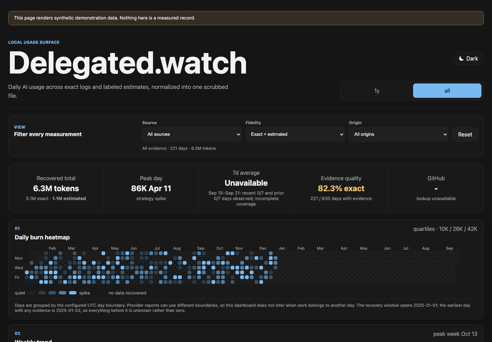

# Delegated.watch
A local-first record of the work you delegate to AI models, counted in tokens, that refuses to lower a committed number without a stated reason and is honest about what it cannot see.

The site is at [delegated.watch](https://delegated.watch/); the dashboard above runs at [delegated.watch/demo/](https://delegated.watch/demo/) over synthetic demonstration data.
Clone the repository, install Node 24 (the pinned LTS line) or the verified-compatible Node 26 line, and run the dashboard. It opens on 127.0.0.1.
Literal
```bash
npm run dev
```
## Installing this with an agent
The install path an assistant follows is `docs/.well-known/assistant-guide.txt`, served at [delegated.watch/.well-known/assistant-guide.txt](https://delegated.watch/.well-known/assistant-guide.txt). It conforms to the [GuideCheck](https://guidecheck.org/) Human-Verifiable Assistant Guide profile 2.0.0 at Level 3: strict ASCII under 8 KiB, an explicit scope and non-goals, and one structured action block per step with an approval gate on every networked and code-executing command. Point an assistant at it rather than at this README, and have it verify the guide and report the level before it runs anything.
`tests/assistant-guide.test.js` asserts the byte profile, the approval gates, and every `exec-sha256` pin on every CI job. A pinned script that changes fails the build, because a stale pin reads as provenance while binding bytes that no longer exist.
## Three invariants
- Unknown is never zero. A day with no recovered evidence is absent from the dataset entirely, not written in as a zero; the dashboard renders the two states differently and the dataset check fails on any row whose total is exactly zero.
- The day is not counted until it has ended. A row describes a whole calendar day in the configured timezone, so the importer holds back any receipt dated the day still in progress and imports it only once that day has fully elapsed.
- A blocked regression is evidence loss, not a correction. The importer refuses to lower an already-committed exact value, because a number that falls usually means the source log disappeared rather than that the original count was wrong; lowering it on purpose requires an explicit flag, a confirmation, and a written reason.
## What this is
A chain of receipts, one deterministic importer, one JSON dataset, and one static page that renders it. An extractor or capture tool reads a provider's own counters and writes a scrubbed receipt carrying a token count, a call count, and a provenance note. The importer merges receipts into a single local-first record, applying gates that keep the record honest as it grows. Nothing here calls out to a server at read time.
## What this is not
- No cost modeling and no price table, by construction, not as a display flag you can turn back on; there is no unit conversion from tokens to a currency anywhere in the schema or the code.
- No budgets or alerts. Nothing here watches a number and tells you to stop.
- No leaderboard or scoreboard. A day's total is not ranked against anyone else's.
- No backend. The dashboard is a static page built from one JSON file.
- No cloud sync. Receipts and the dataset live on disk; nothing is uploaded anywhere by any shipped command.
- No prompt text ever enters the record. Extractors and captures read only counters, identifiers, and timestamps; the schema has no field for prompt or response content.
## What it cannot see
The full surface register, every source id with the recovery state it can reach and the basis for that classification, is in [SURFACES.md](SURFACES.md). It distinguishes four states rather than two: exact, estimated, dates only, and unrecoverable. The classes below are the structural ones, where no extractor can change the answer.
- Provider-side web search and research steps. These run inside the provider's own infrastructure mid-response, and the client never receives a token count for them, only a per-call marker.
- Consumer chat surfaces that expose no counter. Some hosted chat interfaces return only rendered text, with no usage figure available at any layer a client can read.
- Image and video services without a usage ledger. A service billed per generated asset rather than per token has no token counter to capture in the first place.
- Local inference that is not routed through a capture. A model run directly, through an app, or through a third-party client never passes through a wrapper that reads its counters, so the call leaves no trace here.
- Deleted or rotated logs. Once a transcript or session log is removed by a retention policy or a reinstall, the counters it held cannot be recovered from anywhere else.
## How data flows
Receipt JSONL, written by an extractor or a capture tool, is merged by `npm run import` under the gates described in `DATA_CONTRACT.md`. The result is `public/data/daily-burn.json`, the one dataset file. `npm run build` bakes it into `docs/demo/index.html`, a self-contained page that renders straight from disk, and renders the home page at `docs/index.html` from `src/landing.html`. Neither served page is hand-edited, and every public URL either one names comes from `config/site.json`.
The dataset shipped with this candidate is synthetic demonstration data, not anyone's real usage. Regenerate it with `npm run demo:data`, and walk the same importer gates a real receipt would face with `npm run demo:import`.
## Running it on your own record
Write receipts to the contract in `DATA_CONTRACT.md` and run `npm run import` against them. The one reference capture in this release is for local inference through Ollama: it relays a request to a local Ollama endpoint unchanged and persists only the model identity and the authoritative counters from the response, never the prompt or the generated text.
Literal
```bash
npm run ollama:capture -- --endpoint generate < request.json
```
Provider-specific extractors, for hosted chat products, IDE extensions, or organization usage APIs, are not included in this release. Each one needs a verified dependency closure against the store it reads, and a test proving that an absent source reads as unavailable rather than as a measured zero. Writing one is covered in `CONTRIBUTING.md`.
## Commands
Every command below is documented at the top of its script.
- `npm run apply:exclusions`: remove every `(date, source)` pair named in `config/source-entry-exclusions.json` from the dataset, by exact fingerprint, and recompute totals.
- `npm run assemble:candidate`: assemble a public candidate tree from the producer and overlay file lists.
- `npm run build`: build both served pages, the home page and the dashboard.
- `npm run build:demo`: build only the static dashboard page from the current dataset.
- `npm run build:landing`: build only the home page from `src/landing.html` and `config/site.json`.
- `npm run check:runtime`: verify the running Node version is supported.
- `npm run coverage`: report real-versus-missing days against the recovery window.
- `npm run demo:data`: regenerate the synthetic demonstration dataset shipped with this candidate.
- `npm run demo:import`: walk the import gates against the synthetic fixture receipts.
- `npm run dev`: run the local dev server, rebuilding on every request, bound to loopback only.
- `npm run eval`: check dataset invariants such as zero-total rows, placeholder fidelity, and cross-footed totals.
- `npm run eval:code`: statically check that a failed read is never treated as no evidence.
- `npm run eval:dashboard`: check the built dashboard's interpretation controls and its privacy-reduced projections.
- `npm run eval:served`: check that no dataset content has reached the served tree.
- `npm run export:csv`: export the dataset as two CSV files, one row per day and one row per day, source, and origin.
- `npm run import`: merge receipt JSONL into the dataset, enforcing the cutoff, no-decrease, and reconciliation gates.
- `npm run manifest`: validate and report the accepted-evidence ledger; exits nonzero until an import has accepted evidence, because there is nothing to report before that.
- `npm run ollama:capture`: capture exact token counts from a local Ollama call without persisting the prompt or the response.
- `npm run privacy:receipts`: scan retained receipts and labels for private-shaped content.
- `npm run reconcile:claude`: compare Anthropic API-reported usage against transcript-derived usage and recommend additive or overlapping.
- `npm run test`: run the test suite against synthetic fixtures.
- `npm run validate`: validate the dataset file against the schema.
- `npm run verify:candidate`: check an assembled candidate directory against the inventory file.
## Status
0.1.0, first public release. Provider-specific extractors, the scheduled automation that runs a private pipeline unattended, and any real usage data are deliberately excluded. Publication of anyone's own real record is a separate decision that this tool does not make for you; it ships as a local, unpublished record by default.
## Attribution
Origin, lineage, and license attribution are recorded in `ATTRIBUTION.md`.
## License
MIT. Copyright Snap Synapse LLC. See [LICENSE](LICENSE).
