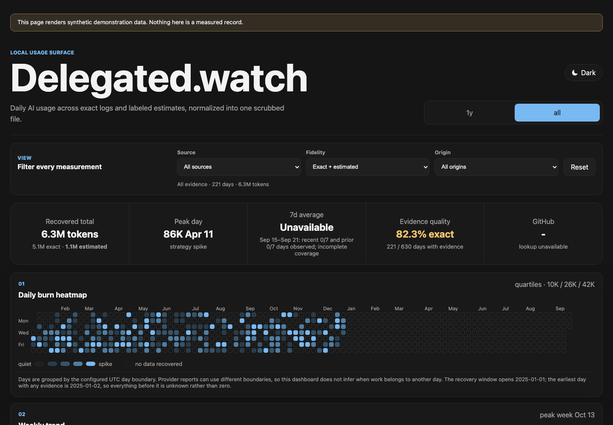

# Delegated.watch
A local-first record of the work you delegate to AI models, counted in tokens, that refuses to lower a committed number without a stated reason and is honest about what it cannot see.
Tokens here are the units a language model consumes reading and writing text. Not cryptocurrency: there is no blockchain, no supply, no burning in that sense, and nothing in the schema or the code is denominated in any currency. Not to be confused with delegated.to, a different company.

The site is at [delegated.watch](https://delegated.watch/); the dashboard above runs at [delegated.watch/demo/](https://delegated.watch/demo/) over synthetic demonstration data.
Install Node 24 (the pinned LTS line) or the verified-compatible Node 26 line, then clone the repository. There are no runtime dependencies, so there is no install step.
Literal
```bash
git clone https://github.com/snapsynapse/delegated-watch.git && cd delegated-watch
```
Run the dashboard. It opens on 127.0.0.1.
Literal
```bash
npm run dev
```
## Installing this with an agent
The install path an assistant follows is `docs/.well-known/assistant-guide.txt`, served at [delegated.watch/.well-known/assistant-guide.txt](https://delegated.watch/.well-known/assistant-guide.txt). It conforms to the [GuideCheck](https://guidecheck.org/) Human-Verifiable Assistant Guide profile 2.0.0 at Level 4, the highest level a guide file can reach: strict ASCII under 8 KiB, an explicit scope and non-goals, one structured action block per step with an approval gate on every networked and code-executing command, a sidecar manifest pinning the guide's exact bytes, and that hash cross-published as a DNS TXT record at `_assistant-guide.delegated.watch` so you can confirm through a second channel that the bytes you read are the bytes being served. Point an assistant at it rather than at this README, and have it verify the guide and report the level before it runs anything.
`tests/assistant-guide.test.js` asserts the byte profile, the approval gates, every `exec-sha256` pin, and the manifest against the guide's actual bytes on every CI job. A pinned script that changes fails the build, because a stale pin reads as provenance while binding bytes that no longer exist.
## Three invariants
- Unknown is never zero. A day with no recovered evidence is absent from the dataset entirely, not written in as a zero; the dashboard renders the two states differently and the dataset check fails on any row whose total is exactly zero.
- The day is not counted until it has ended. A row describes a whole calendar day in the configured timezone, so the importer holds back any receipt dated the day still in progress and imports it only once that day has fully elapsed.
- A blocked regression is evidence loss, not a correction. The importer refuses to lower an already-committed exact value, because a number that falls usually means the source log disappeared rather than that the original count was wrong; lowering it on purpose requires an explicit flag, a confirmation, and a written reason.
## What this is
A chain of receipts, one deterministic importer, one JSON dataset, and one static page that renders it. An extractor or capture tool reads a provider's own counters and writes a scrubbed receipt carrying a token count, a call count, and a provenance note. The importer merges receipts into a single local-first record, applying gates that keep the record honest as it grows. Nothing here calls out to a server at read time.
## What this is not
- No cost modeling and no price table, by construction, not as a display flag you can turn back on; there is no unit conversion from tokens to a currency anywhere in the schema or the code.
- No budgets or alerts. Nothing here watches a number and tells you to stop.
- No leaderboard or scoreboard. A day's total is not ranked against anyone else's.
- No backend. The dashboard is a static page built from one JSON file.
- No cloud sync. Receipts and the dataset live on disk; nothing is uploaded anywhere by any shipped command.
- No prompt text ever enters the record. Extractors and captures read only counters, identifiers, and timestamps; the schema has no field for prompt or response content.
## What it cannot see
The full surface register, every source id with the recovery state it can reach and the basis for that classification, is in [SURFACES.md](SURFACES.md). It distinguishes four states rather than two: exact, estimated, dates only, and unrecoverable. The classes below are the structural ones, where no extractor can change the answer.
- Provider-side web search and research steps. These run inside the provider's own infrastructure mid-response, and the client never receives a token count for them, only a per-call marker.
- Consumer chat surfaces that expose no counter. Some hosted chat interfaces return only rendered text, with no usage figure available at any layer a client can read.
- Image and video services without a usage ledger. A service billed per generated asset rather than per token has no token counter to capture in the first place.
- Local inference that is not routed through a capture. A model run directly, through an app, or through a third-party client never passes through a wrapper that reads its counters, so the call leaves no trace here.
- Deleted or rotated logs. Once a transcript or session log is removed by a retention policy or a reinstall, the counters it held cannot be recovered from anywhere else.
## How data flows
Receipt JSONL, written by an extractor or a capture tool, is merged by `npm run import` under the gates described in `DATA_CONTRACT.md`. The result is `public/data/daily-burn.json`, the one dataset file. `npm run build` bakes it into `docs/demo/index.html`, a self-contained page that renders straight from disk, and renders the home page at `docs/index.html` from `src/landing.html`, with `docs/sitemap.xml` beside it. Neither served page is hand-edited, and every public URL either one names comes from `config/site.json`.
The dataset shipped with this candidate is synthetic demonstration data, not anyone's real usage. Regenerate it with `npm run demo:data`, and walk the same importer gates a real receipt would face with `npm run demo:import`.
## Running it on your own record
The goal is that you install this, point it at your own machine and accounts, and see all of your own delegated work: every surface, every provider, as far back as the evidence survives. [SURFACES.md](SURFACES.md#supported-services) lists which services ship today, which have tested extractors being ported, and which are not yet supported.

For Claude Code, the Claude desktop app's agent sessions, Codex, goose, and the Cline family of VS Code agent extensions, extract your own local history and import it:

Literal
```bash
npm run extract:claude-code; npm run extract:codex; npm run extract:goose; npm run extract:vscode-agents; npm run import && npm run build && npm run dev
```

The extractor reads the transcript store read-only (`$CLAUDE_CONFIG_DIR/projects`, or `~/.claude/projects`) and the desktop app's session stores, writes one receipt file per source under `scratch/receipts/`, and reports each store as read, not found, or unreadable. Unreadable exits 3, because that usage is unknown rather than zero. Point `--root` at a backup of the transcript store to recover days the CLI has since pruned. The Codex extractor reads `$CODEX_HOME` (or `~/.codex`) the same way, counting non-cached input plus output; to read a backup or a store copied from another machine, pass `--sessions DIR` with `--local-store` for your own store or `--tag ORIGIN` for someone else's. The goose extractor opens goose's `sessions.db` read-only through Node's built-in SQLite, so no `sqlite3` program is needed; it maps local models to their family (`qwen_local`, `gemma_local`) and labels calls goose routed to a hosted provider as `goose_<provider>`. Ledger rows with cache reads need `--cache-convention`, because whether goose's input count includes them varies by provider. The VS Code agents extractor reads Cline, Roo Code, Kilo Code, and Snapdev task stores in VS Code, VS Code Insiders, VSCodium, Cursor, and Windsurf; records whose cache counters fit both counting conventions need `--token-convention legacy` or `inclusive`, which depends on the provider the extension was pointed at.

For any other source, write receipts to the contract in `DATA_CONTRACT.md` and run `npm run import` against them. For local inference through Ollama, relay calls through the capture: it relays a request to a local Ollama endpoint unchanged and persists only the model identity and the authoritative counters from the response, never the prompt or the generated text.
Literal
```bash
npm run ollama:capture -- --endpoint generate < request.json
```
For API usage, the organization usage reports are the provider's own count of every call made with the organization's keys. Each extractor reads an admin key from its environment variable and skips cleanly without one. Never commit a key, paste it into a chat, or type it on a command line, where shell history keeps it. Reading it without echo avoids all three. After this command starts, the shell waits silently: paste the Anthropic admin key, which is not shown, and press Return.

Literal
```bash
read -rs ANTHROPIC_ADMIN_KEY && export ANTHROPIC_ADMIN_KEY && npm run extract:claude-api
```

The same for OpenAI: paste the organization admin key, which is not shown, and press Return.

Literal
```bash
read -rs OPENAI_ADMIN_KEY && export OPENAI_ADMIN_KEY && npm run extract:openai-api
```

An organization report covers every client that used its keys, so it can overlap a local extractor that counted the same calls: Claude Code or Codex signed in with an API key, or an editor extension or agent pointed at the same organization. Anthropic receipts are therefore held in `scratch/reconcile/` until `npm run reconcile:claude` compares them with your Claude Code record and you record a verdict in `config/claude-reconciliation.json`. OpenAI has no reconciliation step yet; if your local OpenAI clients use an API key rather than a ChatGPT sign-in, leave `openai_api` out rather than count those calls twice.

Consumer chat products report no token counts, but their account data exports hold the conversations, so usage can be estimated at about four characters per token. Request an export from claude.ai (Settings, Privacy, Export data) or ChatGPT (Settings, Data controls, Export data), unzip a claude.ai export into `raw/claude-export-<date>/`, and place a ChatGPT export ZIP, manifest, or `conversations.json` anywhere under `raw/`, which is never committed. Then:

Literal
```bash
npm run estimate:claude-chat; npm run estimate:chatgpt
```

The claude.ai estimate counts everything that entered or left the model, including thinking, tool calls, tool results, and attachment text, but not the context each turn re-sends, so it is a floor. Overlapping exports dedupe by message. A ChatGPT ZIP is read with the `unzip` program; where that is missing, extract it and point the estimator at the extracted files. The record starts at `window_start` in `config/profile.json`, 2022-11-30 by default, which is ChatGPT's public launch; set it earlier only if your history predates it.

An extractor for Perplexity has been tested and is being ported; each ships once it clears the bar in `CONTRIBUTING.md`. Writing an extractor for a service that is not yet supported is covered there too.
## Commands
Every command below is documented at the top of its script.
- `npm run apply:exclusions`: remove every `(date, source)` pair named in `config/source-entry-exclusions.json` from the dataset, by exact fingerprint, and recompute totals.
- `npm run assemble:candidate`: assemble a public candidate tree from the producer and overlay file lists.
- `npm run build`: build both served pages, the home page and the dashboard.
- `npm run build:demo`: build only the static dashboard page from the current dataset.
- `npm run build:landing`: build only the home page and `sitemap.xml` from `src/landing.html` and `config/site.json`.
- `npm run check:runtime`: verify the running Node version is supported.
- `npm run coverage`: report real-versus-missing days against the recovery window.
- `npm run demo:data`: regenerate the synthetic demonstration dataset shipped with this candidate.
- `npm run demo:import`: walk the import gates against the synthetic fixture receipts.
- `npm run dev`: run the local dev server, rebuilding on every request, bound to loopback only.
- `npm run eval`: check dataset invariants such as zero-total rows, placeholder fidelity, and cross-footed totals.
- `npm run eval:code`: statically check that a failed read is never treated as no evidence.
- `npm run eval:dashboard`: check the built dashboard's interpretation controls and its privacy-reduced projections.
- `npm run eval:served`: check that no dataset content has reached the served tree.
- `npm run extract:claude-code`: extract exact daily usage from Claude Code transcripts and the Claude desktop app's agent sessions, excluding cache reads from the headline.
- `npm run extract:codex`: extract exact daily usage from Codex rollout files, excluding cached input from the headline.
- `npm run extract:goose`: extract exact daily usage from goose's usage ledger, local models by family and hosted providers labelled as goose traffic.
- `npm run extract:vscode-agents`: extract exact daily usage from Cline, Roo Code, Kilo Code, and Snapdev task counters in every VS Code-family editor.
- `npm run extract:claude-api`: extract exact daily usage from the Anthropic Admin Usage Report, quarantined until a reconciliation verdict is recorded. Needs `ANTHROPIC_ADMIN_KEY`.
- `npm run extract:openai-api`: extract exact daily text-token usage from the OpenAI organization Usage API. Needs `OPENAI_ADMIN_KEY`.
- `npm run estimate:chatgpt`: estimate daily ChatGPT usage from an OpenAI account export, at four characters per token.
- `npm run estimate:claude-chat`: estimate daily claude.ai and Claude Design usage from an account export, at four characters per token, as a floor.
- `npm run export:csv`: export the dataset as two CSV files, one row per day and one row per day, source, and origin.
- `npm run import`: merge receipt JSONL into the dataset, enforcing the cutoff, no-decrease, and reconciliation gates.
- `npm run manifest`: validate and report the accepted-evidence ledger; exits nonzero until an import has accepted evidence, because there is nothing to report before that.
- `npm run ollama:capture`: capture exact token counts from a local Ollama call without persisting the prompt or the response.
- `npm run privacy:receipts`: scan retained receipts and labels for private-shaped content.
- `npm run reconcile:claude`: compare Anthropic API-reported usage against transcript-derived usage and recommend additive or overlapping.
- `npm run test`: run the test suite against synthetic fixtures.
- `npm run validate`: validate the dataset file against the schema.
- `npm run verify:candidate`: check an assembled candidate directory against the inventory file.
## Roadmap
What is planned, in priority order, and what has been decided against permanently, is in [ROADMAP.md](ROADMAP.md).
## Status
0.2.1. The first public release was 0.1.0, on the same day. This release ships the importer, its gates, the dashboard, extractors for Claude Code, Codex, goose, the Cline family of VS Code agent extensions, and the Anthropic and OpenAI usage APIs, estimators for the claude.ai and ChatGPT exports, and the Ollama capture; the tested extractors are being ported, per `ROADMAP.md`. No real usage data is included. Publication of anyone's own real record is a separate decision that this tool does not make for you; it ships as a local, unpublished record by default.
## Contributing
Ground rules, commit conventions, and what a change to a design invariant requires are in [CONTRIBUTING.md](CONTRIBUTING.md). Report a vulnerability privately as described in [SECURITY.md](SECURITY.md), not in a public issue.
## Attribution
Origin, lineage, and license attribution are recorded in `ATTRIBUTION.md`.
## License
MIT. Copyright Snap Synapse LLC. See [LICENSE](LICENSE).
